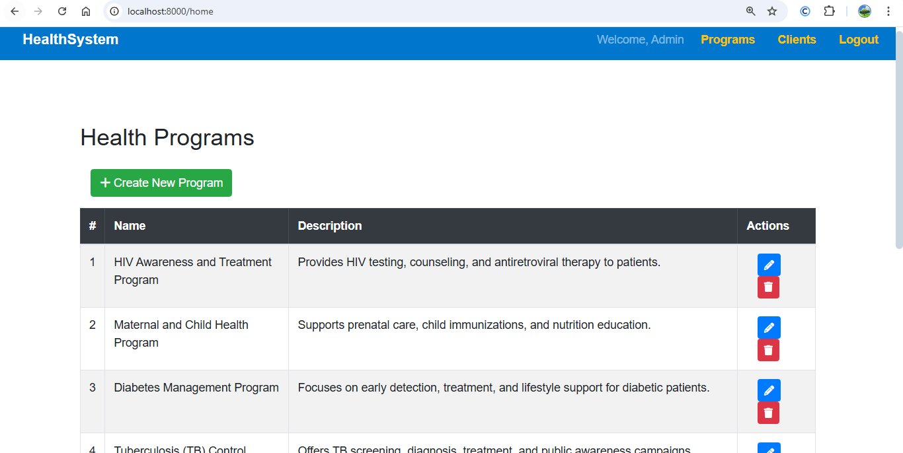
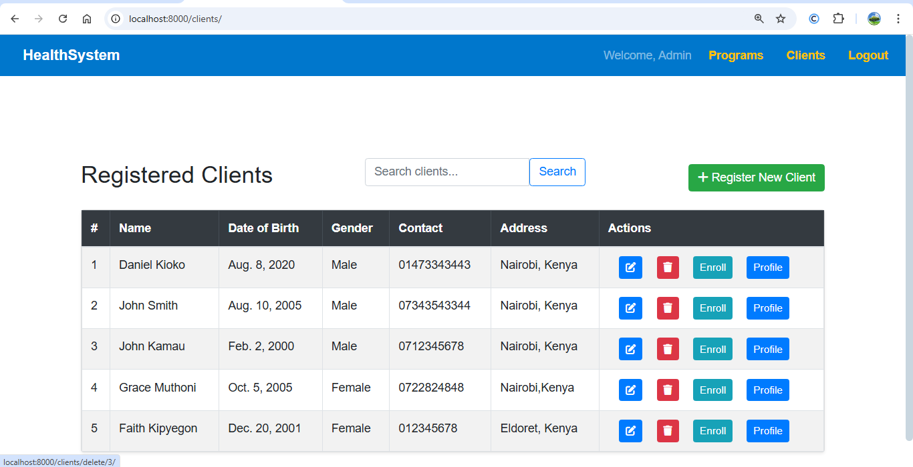
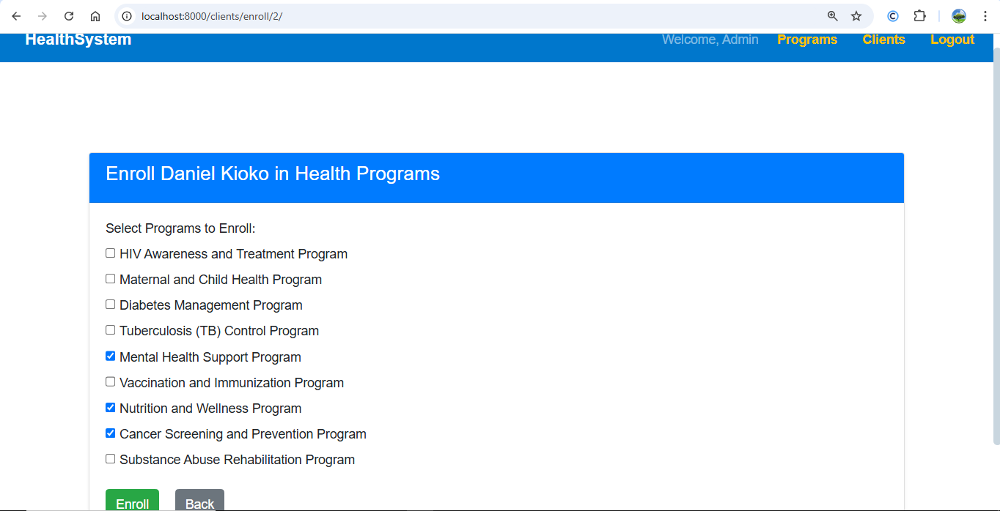
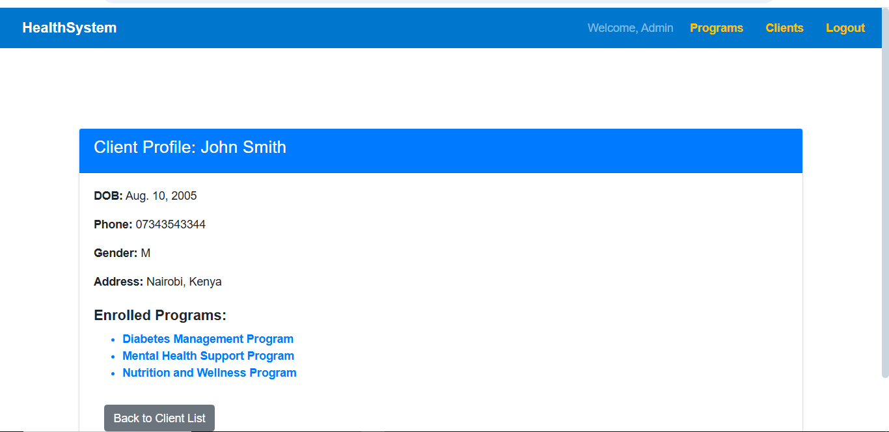

# CEMA-Basic-Health-Information-System

# Project Overview

This is a simple Django-based Health Information System designed to manage clients and health programs.
The system allows you to register clients, enroll them into health programs, and easily manage records through a clean, User Interface.

It also features a public API endpoint to retrieve client profiles in JSON format.

# Features

Register, edit, and delete clients.

Create, edit, and delete health programs.

Enroll clients into programs.

Search and list clients dynamically.

API endpoint to fetch client profiles in JSON format (REST API).

User authentication with a custom login page.

Created_at timestamp field for program records.

UI built with Bootstrap.

Application-level tests for reliability.

# Technologies Used

Backend: Django (Python)

Frontend: Bootstrap 5, HTML5

Database: SQLite (default for development)

Other: Django REST Framework, Font Awesome

# Installation Instructions 🚀

1. Clone the Repository

2. Create a Virtual Environment
   in your system, navigate to the folder you would like to place the project in and run this commands
   python -m venv venv

source venv/bin/activate  
venv\Scripts\activate on windows

3. Install Dependencies
   run this command
   pip install -r requirements.txt

4. Create Superuser (Optional)
   python manage.py runserver

5. Run the Development Server
   python manage.py runserver

# API Usage 📡

Get Client Profile API
URL: /api/client-profile/<client_id>/

Returns client data along with enrolled programs in JSON format.

Example:
GET http://127.0.0.1:8000/api/client-profile/3/

# List Of Programs

# List of Clients

# Client Enrollment to Programs

# Client Profile with enrolled programs

